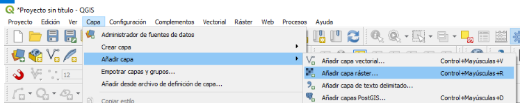
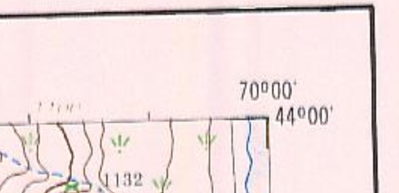
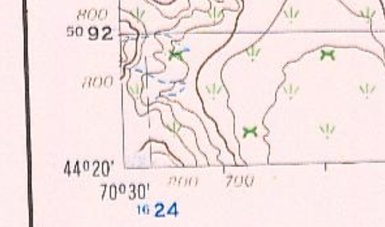
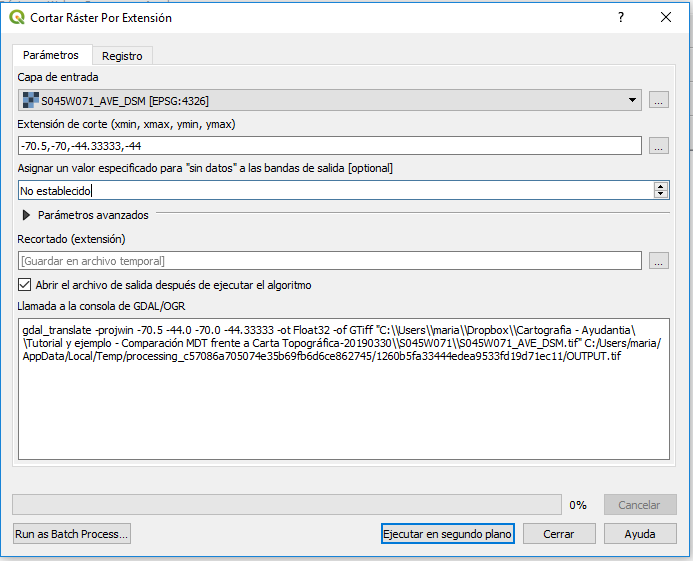
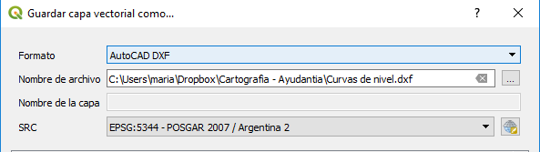
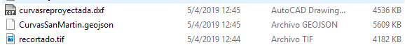
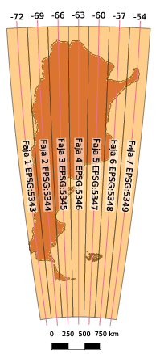
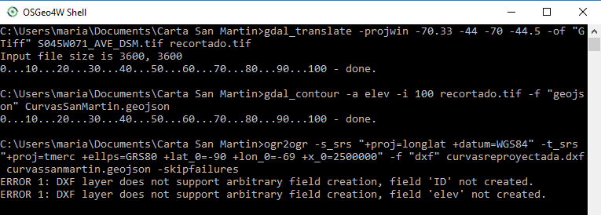

# Extraer curvas de nivel de un modelo raster con QGis

En este tutorial, partiendo de un archivo raster en formato .tiff
del modelo digital de elevaciones PALSAR,
que contiene información de elevaciones de terreno,
generaremos curvas de nivel. En otras palabras, vectorizaremos
información altimétrica del terreno que viene dada en formato raster.
Para ello utilizaremos el software QGis.

Los archivos del tipo GeoTiff, como los utilizados en nuestro caso, pueden contener
distintos tipos de información. Sin embargo, su característica distintiva es que 
este formato soporta agregar información de referencia geográfica a la información
púramente raster contenida en él.

## Aclaración sobre el Funcionamiento de QGis

Los software del tipo GIS --sistema de información geográfica--
es específico para el manejo de información georreferenciada. Su principal capacidad
es la de interpretar coordenadas almacenadas en distintos tipos de archivos
y mostrarlas en forma geográficamente correcta, teniendo en cuenta los distintos
sistemas de referencia y de representación en los que están expresadas las coordenadas.

En este ejemplo, utilizaremos QGis a modo de herramienta de procesamiento,
ingresando nuestra información ráster en una capa, y sometiendo a la misma
a distintos procesos en forma secuencial,
extrayendo en cada caso una nueva capa modificada.
De esta manera el archivo ingresado no se modifica en el proceso, sino
que se crean sucesivas capas temporales que, en caso de ser de interes,
deben guardarse como nuevos archivos, **antes de cerrar el programa**.

Aclaramos que, aún cuando se grabe el proyecto en QGis, si no se graba cada capa
temporal a alguna ruta conocida, no será posible recuperar dichas capas al volver a abrir el proyecto.

## Paso 1: Cargar archivo raster

Partiendo del archivo .tiff descargado, el primer paso consiste en cargarlo 
en una nueva capa raster. En el menu superior, la opción a utilizar para ello es la que sigue.

> Capas \> Añadir capa \> Añadir capa ráster.

{width="5.905555555555556in" height="1.16875in"}

Para elegir el archivo desado, en el dialogo desplegado se hace
clic en el ícono "...", se busca la ruta correspondiente, presionando luego añadir.

Una vez realizado este paso veremos añadirse al panel de capas --listado en la parte
inferior izquierda de la pantalla-- la nueva capa.

## Paso 2: Recortar archivo raster.

El paso que sigue no es estricamente obligatorio, pero aporta a obtener un archivo
más fácil de procesar.

Debe notarse que los límites del modelo y la zona de trabajo deseada no
son necesariamente coincidentes, de manera tal que resulta útil recortar el ráster 
al area de interés. En el caso que nos ocupa, el area de interés que queda definida por
los límites de la carta elegida para el trabajo práctico. Las coordenadas del límite 
las expresaremos en coordenadas geográficas, con grado y decimal de grado, porque es éste
el sistema de referencia utilizado en el archivo raster que manejamos -- ver [epsg:4326](https://epsg.io/4326) --.

Para el trabajo que realizaremos, la carta fue provista en formato jpeg, es decír que es una
imagen sin información de georreferenciación. Sin embargo,
los límites de la carta estan expresados explícitamente en los
vértices inferior izquierdo y superior derecho de la representación, tal como se ve en las figuras 2 y 3.

{width="2.4895833333333335in"
height="1.207904636920385in"}

{width="1.976755249343832in"
height="1.1666666666666667in"}

> Es importante en este momento notar que el sistema de coordenadas
> que estamos utilizado en QGis es como ya dijimos epsg:4326,
> y podemos verificarlo en la esquina inferior derecha,
> este sistema es simplemente la asignación de y=longitud , x=latitud en grados.

La herramienta que utilizaremos para cortar los datos se encuentra en la caja de herramientas
de procesos, utilizando el buscador que aparece en la parte derecha de la
pantalla. El nombre de la herramienta es "cortar ráster por extensión"

{width="5.905555555555556in"
height="4.780555555555556in"}

Los datos requeridos por esta herramienta son el nombre de
la capa a recortar y los limites expresados como máximos y mínimos de x e y, 
interpertados como longitud y latitud respectivamente.
Es importante recordar que las coordenadas geográficas oeste y sur tienen signo negativo.

Una vez realizado este paso, estaremos en condiciones de generar las curvas de nivel. En caso de saltearlo y utilizar 
el raster completo para la generación de curvas, el tiempo de procesamiento se verá aumentado.

## Paso 3: Generacion de curvas de nivel:

Para el tercer paso utilizaremos, nuevamente de la caja de herramienta de procesos,
la herramienta que aparece como "curvas de nivel".

Los datos requeridos son la capa de entrada, la equidistancia y un nombre de atributo para asignar la altura correspondiente a cada línea.
La equidistancia deberá elegirse en funcion de las características de la zona de trabajo,
teniendo en cuenta que debemos lograr curvas que permitan
apreciar los picos de altura y sean comparables con las curvas de la carta.
El nombre de atributo es arbitrario y puede dejarse el valor que viene por defecto

Es posible que en este paso se generen capas innecesarias, producto de elegir valores no 
adecuados de equidistancia.

**Para eliminar una capa añadida a QGis**, se debe
haciendo clic derecho sobre el nombre de capa \> Remove layer

## Paso 4: Guardar y reproyectar el archivo de curvas de nivel.

Una vez finalizado el proceso de vectorizacion, el paso que sigue será la
exportación de la capa en un formato conveniente, y la reproyección del mismo 
a un sistema de coordenadas adecuado para la zona de trabajo.

> **Para exportar una capa desde Qgis**, en el panel de capas hacemos
> Clic derecho sobre capa \> Exportar \> Save features as
> 
> y debemos
>
>-   Elegir formato de archivo: por ejemplo .dxf de manera que sea
>    compatible con AutoCad.
>
>-   Elegir nombre y ubicación del archivo: Seleccionar una ubicación
>    válida para guardar el archivo, haciendo clic sobre "..." a la
>    derecha de "Nombre de archivo".
>
>-   Elegir el SRC correspondiente. En el ejemplo Posgar07 con el número de faja que
>    corresponda a la carta elegida --ver figura 5--

{width="5.905555555555556in"
height="1.6631944444444444in"}

# Generación de Curvas con GDAL y OGR, desde *OsGeo4w Shell*

Una forma alternativa para extraer curvas de nivel a partir de un archivo ráster
es utilizar las herramientas de línea de comandos de GDAL y OGR, accesibles
a través de la consola OsGeo4w Shell, que se instala junto con QGis.
El procedimiento a seguir es similar al utilizado para la extracción QGIS,
pero el procesado se hace sin necesidad de observar las salidas gráficas intermedias.

Para iniciar recomendamos utilizar una ruta fácil de tipear, cercana a la raiz del disco
utilizado -- C:, D:, etc.. --, Por ejemplo: C:\\Users\\maria\\Documents\\CartaSanMartin

La consola OsGeo4w Shell tiene un comportamiento similar a la línea de comandos
tradicional de windows, a la que se accede con la orden "cmd" desde el menú de inicio.
Recordamos que en este contexto el clic derecho funciona como comando de copiar y pegar textos
seleccionados en la consola, como por ejemplo la ruta al archivo.

## Paso 1: Recortar el archivo raster

Para empezar debemos abrir la consola, que puede ubicarse desde el buscador del menú de inicio ingresand
en el cuadro de búsqueda "osgeow4". Una vez abierta nos moveremos al directorio en el que está el archivo
utilizando el comando [cd](https://www.computerhope.com/cdhlp.htm):

C:\\\> cd Users\\maria\\Documents\\CartaSanMartin

La orden que utilizaremos para cortar el archivo raster es "gdal_translate", los parámetros e ingresan
en general con un nómbre de opción precedido de un "-" y luego el parámetro de la upcion. Por ejemplo,
la opción -projwin lleva 4 parámetros que son los límites del recorte a realizar, recorridos en sentido
horario comenzando por la longitud del borde izquierdo.

Para cualquiera de las ordenes a ingresar, si se ingresa el comando sin parámetros se obtiene la ayuda de uso.

El comando completo para cortar un archivo raster, suponiendo que se llama "entrada.tif" y se quiere obtener un
archivo cortado "salida.tif", es:

```
gdal\_translate -projwin x\_izq y\_arriba x\_der y\_abajo -of \"GTiff\"
entrada.tif salida.tif
```

Los parámetros ingresados en esta caso son

-   **gdal\_translate -projwin:** Comando de recorte.

-   **x\_izq y\_arriba x\_der y\_abajo:** Limites del recorte x min, y
    max, x max, y min, sabiendo que las coordenadas se expresan en:
    latitud=y, longitud=x.

-   **-of:** formato de salida.

-   Nombres de archivo de entrada y salida.

Como ejemplo, para la carta de San Martín, el recorte queda

```
gdal\_translate -projwin -70.33 -44 -70 -44.5 -of \"GTiff\" S045W071\_AVE\_DSM.tif recortado.tif
```

## Paso 2: Generación de curvas de nivel

A partir de la imagen recortada, en el segundo paso se extraerá un archivo vectorial con curvas de nivel.

El comando a utilizar en este caso es "gdal_contour", cuyo uso para nuestro caso es como sigue.

```
gdal\_contour -a elev -i 100 archivoentrada.tif -f "geojson" archivosalida.geojson
```

Donde kas opciones utilizadas fueron

-   **-a:** nombre del atributo del ráster a utilizar.

-   **-i:** Equidistancia.

-   **-f:** formato de archivo de salida.

El mismo ejemplo, con la carta da General San Martin, partiendo del archivo recortado queda

```
gdal\_contour -a elev -i 100 recortado.tif -f "geojson" CurvasSanMartin.geojson
```

Una vez finalizado el proceso, podemos observar en el explorador de archivos si aparece el archivo creado --figura 6--.
Esto puede efectuarse tambien utilizando el comando dir para listar el contenido del directorio desde la linea de comandos.

{width="5.916666666666667in"
height="0.6423611111111112in"}

Hacemos notar que el tipo de archivo generado es [geojson](http://geojson.org/), podria haberse utilizado cualquier otro
tipo de [archivo soportado por ogr](https://www.gdal.org/ogr_formats.html), 

## Paso 3: Reproyeccion de las curvas a la faja correspondiente

El archivo generado previamente, al no haber especificado un cambio de sistema
de coordenadas, está expresado en el mismo sistema del archivo raster original, 
el ya mencionado epsg:4326.

Para lograr un resultado que pueda compararse a la carta debemos utilizar el sistema
Gauss Krugger Argentina con la faja oficial correspondiente.

Para expresar una proyección desde la linea de comandos se utiliza el lenguaje soportado
por la libreria [proj4](https://proj4.org/usage/quickstart.html). En nuestro caso utilizaremos
las proj-strings correspondientes a epsg:4326 y a la faja de Gauss Krugger que corresponda a la
carta elegida.

La expresión de la proyeccion EPSG:4326 es siguiente: \"+proj=longlat +datum=WGS84\"

## Aclaración: Fajas de Gauss Krugger Argentina.

El sistema de proyección cartográfica oficial de la república Argentina, definido por el
instituto geográfico nacional es el sistema Gauss Krugger, que cuenta con 7 fajas -- o zonas -- 
diferenciadas.

Para faja, se aplica una proyección cilíndrica transversa con parámetros
distintos. Una faja abarca un ancho de 3° en longitud, 1.5° a cada lado
respecto a un meridiano central, que se encuentra representado en magnitud verdadera..

Para más información ingresar a la [página oficial del IGN](http://www.ign.gob.ar/NuestrasActividades/ProduccionCartografica/sistemas-de-proyeccion)

Los parámetros de cada faja se listan en la tabla que sigue.

  Faja  Meridiano central   Este Origen    Latitud Origen   Norte Origen   Escala 
  ----- ------------------- ------------- ---------------- -------------- --------
  1     -72°                1.500.000 m              -90°      0 m            1
  2     -69°                2.500.000 m              -90°      0 m            1
  3     -66°                3.500.000 m              -90°      0 m            1
  4     -63°                4.500.000 m              -90°      0 m            1
  5     -60°                5.500.000 m              -90°      0 m            1
  6     -57°                6.500.000 m              -90°      0 m            1
  7     -54°                7.500.000 m              -90°      0 m            1

{width="5cm"}

De la tabla anterior se debe identificar la faja correspondiente al área
de trabajo, y modificar los siguientes parámetros para construir la cadena-proj
de la proyección en que se desea adquirir las curvas:

-   +lon\_0: meridiano central

-   +lat\_0: origen de latitudes

-   +x\_0: coordenada este del meridiano central.


## Continuación Paso 3

El comando que se utilizará en este paso es "ogr2ogr",

las opciones a utilizar son

-    -s\_srs parametros de proyeccion de entrada

-    -t\_srs parametros de proyeccion de salida

-    -f formato de salida

-    -skipfailures para ignorar algunos errores en la creacion del archivo

Las cadenas de la proyecciones a utilzar, por ejemplo para una carta en faja 2 son

-    EPSG: 4326 = "+proj=longlat +datum=WGS84"

-    Faja 2 = "+proj=tmerc +ellps=GRS80 +lat\_0=-90 +lon\_0=-69 +x\_0=2500000"

De manera que la expresión del comando para la reproyectar el archivo de
curvas de nivel obtenido anteriormente en el ejemplo para San Martín es:

```
ogr2ogr -s\_srs \"+proj=longlat +datum=WGS84\" -t\_srs \"+proj=tmerc
+ellps=GRS80 +lat\_0=-90 +lon\_0=-69 +x\_0=2500000\" -f "dxf"
curvasreproyectada.dxf curvassanmartin.geojson -skipfailures
```

## Ejemplo completo

Para ver el ejemplo completo para la carta de San Martín puede consultarse la figura 8.

{width="6.387771216097987in"
height="2.2879997812773403in"}

La ventaja del procesamiento desde la línea de comantos es la escalabilidad de la solución, es decir, 
que en caso de necesitar aplicar el mismo proceso a un grán numero de imágenes, el mismo puede 
hacerse en forma automatizada y sin tenér los problemas de manejo de memoria que trae el cargar
demasiadas capas en simultaneo en el software de GIS que se utilize.
